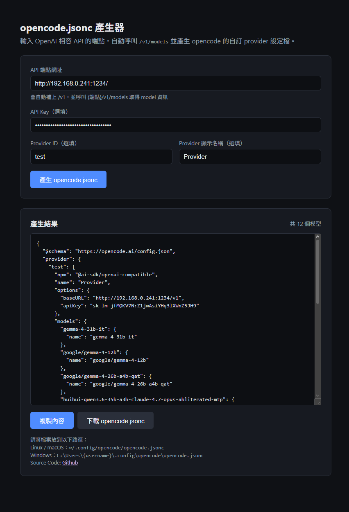

# Opencode-Config-File-Generator

## Main Fuction

It's will auto make a request to the api, get model info and make it into a jsonc for opencode, save your time when you want to try new model with opencode.

